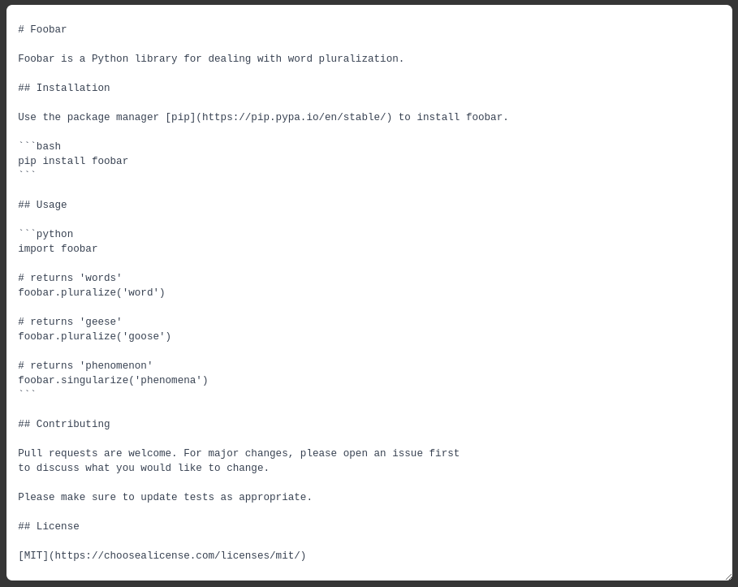
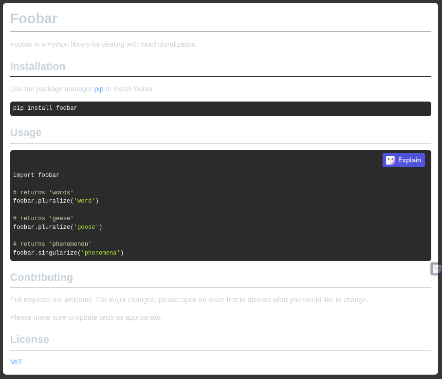

# Tạo README
#### Bởi vì khồng ai đọc được suy nghĩ của bạn
## README 101
### Nó là gì?
README là một tệp văn bản giới thiệu và giải thích một dự án. Nó chứa thông tin thường được yêu cầu để hiểu dự án nói về cái gì.
### Tại sao tôi phải làm điều đó?
Đó là một cách dễ dàng để trả lời các câu hỏi mà người xem có thể sẽ thắc mắc về cách cài đặt và sử dụng dự án cũng như cách cộng tác với bạn.
### Ai nên thực hiện nó?
Bất kỳ ai đang thực hiện một dự án lập trình, đặc biệt nếu bạn muốn người khác sử dụng hoặc đóng góp dự án đó.
### Khi nào tôi nên làm điều đó?
Chắc chắn là trước khi bạn giới thiệu một dự án cho người khác hoặc công khai nó. Bạn có thể muôn staapj thói quaen biến nó thành tệp đầu bạn tạo trong một dự án mới.
### Tôi nên đặt nó ở đâu?
Trong thư mục cao cấp nhất của dự án. Đây là nơi một người mới tham gia dự án của bạn sẽ bắt đầu. Các dịch vụ lưu trữ lệnh như GitHub, Bitbucket và GitLab cũng sẽ tìm README của bạn và hiển thị nó cùng với danh sách các tệp và thư mục trong dự án của bạn.
### Tôi nên làm thế nào?
Mặc dù README có thể được viết ở bất kỳ định dạng tệp văn bản nào, nhưng định dạng phổ biến nhất được sử dụng hiện nay là Markdown. Nó cho phép bạn thêm một số đinh dạng nhẹ. Bạn có thể tìm hiểu thêm về nó tại trang web CommonMark, trang này cũng có hướng dẫn tham khảo hữu ích và hướng dẫn tương tác.
Một số định dạng khác mà banj có thể thấy là văn bản thuần túy reStructuredText (phổ biến trong các dự án Python), và Textile.
Bạn có thể sử dụng bất kỳ trình soạn thảo văn bản nào. Có plugin cho nhiều biên tập viên (ví dụ: Atom, Emacs, Sublime Text, Vim, và Visual Studio Code)
cho phép bạn xem trước Markdown trong khi chỉnh sửa nó.
Bạn cũng có thể sử dụng trình chỉnh sửa Markdown chuyên dụng như Typora hoặc trình chỉnh sửa trực tuyến như StackEdit hoặc Dillinger. Bạn thậm chí có thể sử dụng mẫu có thể chỉnh sửa bên dưới.

## Bản mẫu

### Những gợi ý để có một README tốt
Mỗi dự án đều khác nhau, vì vậy hãy xem xét phần nào trong số này áp dụng cho dự án của bạn. Các phần được sử dụng trong mẫu là gợi ý cho hầu hết các dự án nguồn mở. Ngoài ra, hãy nhớ rằng mặc dù README có thể quá dài và chi tiết, nhưng quá dài vẫn tốt hơn là quá ngắn. Nếu bạn cho rằng README của mình quá dài, hãy cân nhắc sử dụng một dạng tài liệu khác thay vì cắt bớt thông tin.
### Tên
Chọn một tên tự giải thích cho dự án của bạn.
### Miêu tả
Hãy cho mọi người biết cụ thể dự án của bạn có thể làm được những gì. Cung cấp ngữ cảnh và thêm liên kết tới bất kỳ tài liệu tham khảo nào mà khách truy cập có thể chưa quen. Danh sách các Tính năng hoặc phần phụ Nền cũng có thể được thêm vào đây. Nếu có những lựa chọn thay thế cho dự án của bạn thì đây là nơi tốt để liệt kê các yếu tố khác biệt.
### Danh hiệu
Trên một số README, bạn có thể thấy các hình ảnh nhỏ truyền tải siêu dữ liệu, chẳng hạn như liệu tất cả các bài kiểm tra của dự án có vượt qua hay không. Bạn có thể sử dụng Shields để thêm một số vào README của mình. Nhiều dịch vụ còn có hướng dẫn thêm huy hiệu.
### Hình ảnh
Tùy thuộc vào nội dung bạn đang làm, bạn có thể đưa vào ảnh chụp màn hình hoặc thậm chí là video (bạn sẽ thường thấy ảnh GIFs thay vì video thực tế). Các công cụ như ttygif có thể trợ giúp nhưng hãy xem Asciinema để biết phương pháp phức tạp hơn.
### Cài đặt
Trong một hệ sinh thái cụ thể, có thể có một cách phổ biến để cài đặt mọi thứ, chẳng hạn như sử dụng Yarn, NuGet hoặc Homebrew. Tuy nhiên, hãy cân nhắc khả năng người đang đọc README của bạn là người mới và muốn được hướng dẫn thêm. Việc liệt kê các bước cụ thể giúp loại bỏ sự mơ hồ và thu hút mọi người sử dụng dự án của bạn nhanh nhất có thể. Nếu nó chỉ chạy trong một ngữ cảnh cụ thể như phiên bản ngôn ngữ lập trình hoặc hệ điều hành cụ thể hoặc có các phần phụ thuộc phải được cài đặt thủ công, thì hãy thêm tiểu mục Yêu cầu.
### Cách sử dụng
Sử dụng các ví dụ một cách thoải mái và hiển thị kết quả mong đợi nếu có thể. Sẽ rất hữu ích nếu bạn đưa ví dụ nhỏ nhất về cách sử dụng vào nội tuyến, đồng thời cung cấp liên kết đến các ví dụ phức tạp hơn nếu chúng quá dài để đưa vào README một cách hợp lý.
### Hỗ trợ
Cho mọi người biết nơi họ có thể đến để được giúp đỡ. Nó có thể là bất kỳ sự kết hợp nào của trình theo dõi vấn đề, phòng trò chuyện, địa chỉ email, v.v.
### Lộ trình
Nếu bạn có ý tưởng cho các bản phát hành trong tương lai, bạn nên liệt kê chúng trong README.
### Đóng góp
Nêu rõ liệu bạn có sẵn sàng đón nhận những đóng góp hay không và những yêu cầu của bạn để chấp nhận chúng là gì.

Đối với những người muốn thực hiện thay đổi đối với dự án của bạn, việc có một số tài liệu về cách bắt đầu sẽ rất hữu ích. Có lẽ có một tập lệnh mà họ nên chạy hoặc một số biến môi trường mà họ cần đặt. Hãy làm rõ các bước này. Những hướng dẫn này cũng có thể hữu ích cho bản thân bạn trong tương lai.

Bạn cũng có thể ghi lại các lệnh để tìm lỗi mã hoặc chạy thử nghiệm. Các bước này giúp đảm bảo chất lượng mã cao và giảm khả năng các thay đổi vô tình làm hỏng nội dung nào đó. Việc có hướng dẫn chạy thử nghiệm đặc biệt hữu ích nếu việc này yêu cầu thiết lập bên ngoài, chẳng hạn như khởi động máy chủ Selenium để thử nghiệm trên trình duyệt.
### Tác giả và lời cảm ơn
Thể hiện sự đánh giá cao của bạn đối với những người đã đóng góp cho dự án.
### Cấp phép
Đối với các dự án nguồn mở, hãy nói nó được cấp phép như thế nào.
### Tình trạng của dự án
Nếu bạn đã hết năng lượng hoặc thời gian cho dự án của mình, hãy ghi chú ở đầu README nói rằng quá trình phát triển đã chậm lại hoặc dừng hoàn toàn. Ai đó có thể chọn phân nhánh dự án của bạn hoặc tình nguyện tham gia với tư cách là người bảo trì hoặc chủ sở hữu, cho phép dự án của bạn tiếp tục phát triển. Bạn cũng có thể đưa ra yêu cầu rõ ràng cho người bảo trì.
## Câu hỏi thường gặp
### Có định dạng README tiêu chuẩn không?
Không phải tất cả các đề xuất ở đây đều có ý nghĩa đối với mọi dự án, vì vậy, việc đưa thông tin nào nên đưa vào README thực sự tùy thuộc vào các nhà phát triển.
### Một số suy nghĩ khác về việc viết README là gì?
Hãy xem README tuyệt vời để biết danh sách các tài nguyên khác.
### Tệp README nên được đặt tên là gì?
README.md (hoặc một phần mở rộng tệp khác nếu bạn chọn sử dụng định dạng tệp không phải Markdown). Theo truyền thống, nó là chữ hoa để nổi bật hơn, nhưng sẽ không có vấn đề gì lớn nếu bạn nghĩ nó trông đẹp hơn chữ thường.
### Điều gì sẽ xảy ra nếu tôi không đồng ý với điều gì đó, muốn thay đổi hoặc có bất kỳ phản hồi nào khác?
Xin đừng ngần ngại mở một vấn đề hoặc kéo yêu cầu. Bạn cũng có thể gửi tin nhắn cho tôi trên Twitter.
### Đọc ý nghĩ?
Các nhà khoa học và công ty như Facebook và Neuralink (có lẽ) đang nghiên cứu nó. Có lẽ trong tương lai, bạn sẽ có thể đính kèm một bản sao suy nghĩ và/hoặc ý thức của mình vào các dự án của mình. Trong lúc chờ đợi, vui lòng tạo README.
## Cái gì tiếp theo?
### Tài liệu thêm
README là một cách quan trọng nhưng cơ bản để ghi lại dự án của bạn. Mặc dù mọi dự án ít nhất phải có README, nhưng những dự án tham gia nhiều hơn cũng có thể hưởng lợi từ wiki hoặc trang web tài liệu chuyên dụng. GitHub, Bitbucket và GitLab đều hỗ trợ duy trì wiki cùng với dự án của bạn và đây là một số công cụ và dịch vụ có thể giúp bạn tạo trang web tài liệu:
- Daux.io
- Docusaurus
- GitBook
- MkDocs
- Read the Docs
- ReadMe
- Slate
- Docsify

Và để tìm hiểu thêm về tài liệu kỹ thuật nói chung, hãy cân nhắc việc đọc những cuốn sách này (tôi có thể kiếm được hoa hồng nếu bạn mua qua các liên kết này):

- Docs for Developers: An Engineer’s Field Guide to Technical Writing
- Developing Quality Technical Information: A Handbook for Writers and Editors
- Docs Like Code: Collaborate and Automate to Improve Technical Documentation
- The Product is Docs: Writing Technical Documentation in a Product Development Group

### Cấp phép
Nếu dự án của bạn là nguồn mở thì điều quan trọng là phải có giấy phép. Bạn có thể sử dụng trang web này để giúp bạn chọn một.

### Nhật ký thay đổi
Make a README được lấy cảm hứng từ Keep a Changelog. Nhật ký thay đổi là một tệp khác rất hữu ích cho các dự án lập trình.

### Đóng góp
Chỉ cần có phần "Đóng góp" trong README của bạn là một khởi đầu tốt. Một cách tiếp cận khác là tách các hướng dẫn của bạn thành tệp riêng (CONTRIBUTING.md). Nếu bạn sử dụng GitHub và có tệp này thì bất kỳ ai tạo ra sự cố hoặc mở yêu cầu kéo sẽ nhận được liên kết tới nó.

Bạn cũng có thể tạo mẫu vấn đề và mẫu yêu cầu kéo. Những tệp này cung cấp cho người dùng và cộng tác viên của bạn các mẫu để điền thông tin mà bạn cần để phản hồi chính xác. Điều này giúp tránh những tình huống như gặp phải những vấn đề rất mơ hồ. Cả GitHub và GitLab sẽ tự động sử dụng các mẫu.